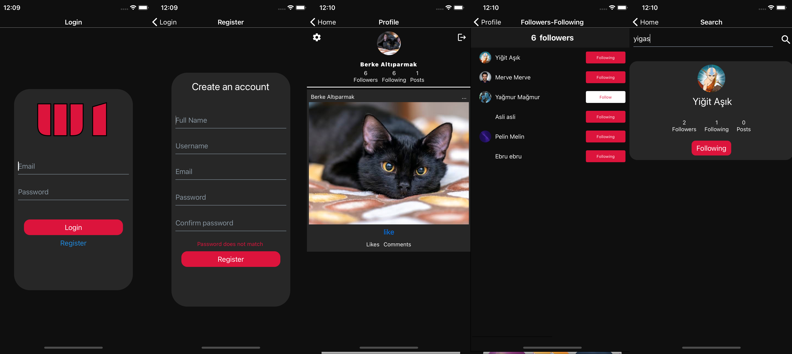

<h2 align="center">
  WhichOne Social Media App 
</h2>

  

 

## Built With

The app is curently on development. Follow for further announcements.  

This project was built using these technologies.

- React Native
- Expo
- Firebase
- VSCode

### Show your support

Give a ⭐ if you like this app!

  <a href="https://api.codetabs.com/v1/loc?github=balpa/whichone&ignored=.expo-shared,assets,app.json,babel.config.js,package.json,package-lock.json,yarn.lock">LOC</a>

